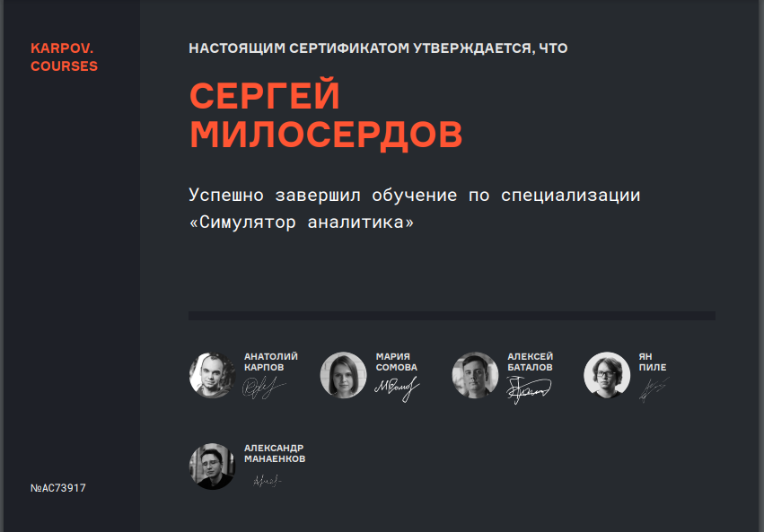

### О себе
Привет, меня зовут Сергей Милосердов, в 2022 году закончил бакалавриат ТГУ по направлению бизнес-аналитика. 
Чтобы прокачать хард-скилы прошел курсы Аналитик даных и Симулятор аналитика от karpov.courses - освоил Python, SQL, airflow, продуктовые метрики. Математическая статистика и теория вероятности была на достаточно хорошем уровне в ВУЗе, тем не менее закрепил ее на курсах.

### Проекты
В проекте [WoTBlitz_analysis](https://github.com/emilliardov/WoTBlitz_analysis) использовал все полученные знания - от выбора метрик для сравнения Player base of WoT Blitz, до построение БД в clickhouse и расчета линеаризованных метрик для корректного сравнения выделенных групп.
В [Analyst-Sim](https://github.com/emilliardov/Analyst-Sim) отображены решения с Симулятора аналитика
